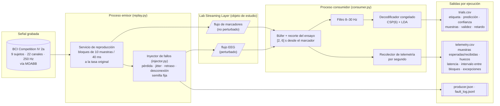
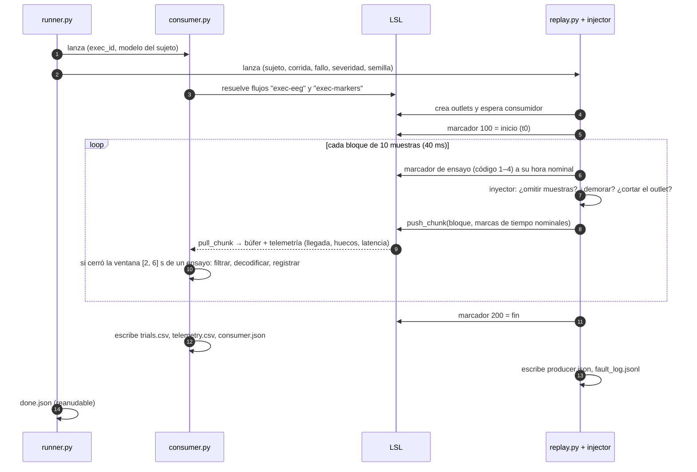
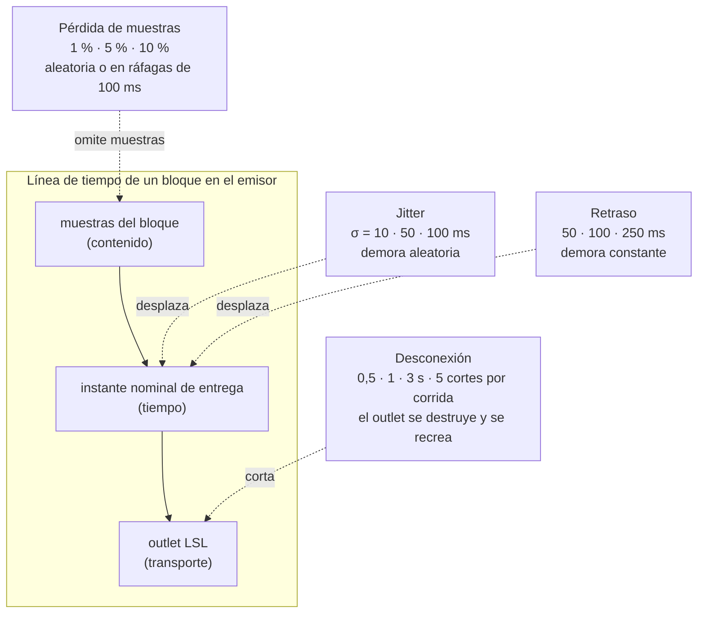
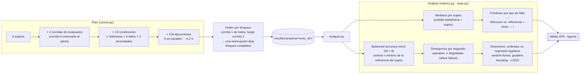

# bci-fault-bench

Banco de experimentación **Software-in-the-Loop** para inyección de fallos en pipelines BCI basados en [Lab Streaming Layer (LSL)](https://labstreaminglayer.org).

> *English summary.* Software-in-the-Loop testbed for fault injection in LSL-based brain-computer interface pipelines. It replays public EEG (BCI Competition IV 2a via MOABB) as a real-time LSL stream, injects controlled faults at the transport interface (sample loss, jitter, delay, disconnection), decodes with a frozen CSP+LDA model and logs per-second telemetry plus per-trial decisions. A resumable orchestrator runs full campaigns in parallel with fixed seeds; the analysis scripts produce descriptive and inferential results (Friedman, Wilcoxon + Holm, effect sizes, rolling-window degradation, silent-failure divergence, threshold vs. model detectors with leave-one-subject-out validation). MIT license.

Instrumento del Trabajo Final de Graduación *Interfaces cerebro-computadora bajo condiciones adversas: del software a la decodificación* (Agustín Tamagusuku, Ingeniería en Software, Universidad Siglo 21, 2026).

---

## 1. La pregunta que responde

Una BCI en tiempo real es una cadena de software: la señal del cerebro se adquiere, **se transporta** entre programas, se preprocesa, se decodifica y se convierte en una acción. El transporte, en el ecosistema abierto, es casi siempre LSL. Sus autores declaran mecanismos de recuperación ante fallas, pero no reportan cuánto se pierde ni cuánto tarda la recuperación, ni qué le pasa al decodificador aguas abajo.

El banco somete a un pipeline real a fallas controladas y repetibles en la capa de transporte y mide, ensayo por ensayo y segundo por segundo, qué le ocurre al flujo de datos y al decodificador.

## 2. Arquitectura



**Dos procesos, dos flujos.** El emisor simula al equipo de registro: entrega cada bloque en el instante en que un amplificador habría adquirido su última muestra, con la marca de tiempo nominal de cada muestra. Los marcadores de inicio de ensayo viajan por un flujo LSL separado que **no se perturba**, porque representan al software de presentación de estímulos, no al transporte de señal. El consumidor es el pipeline bajo prueba: no sabe qué falla está ocurriendo; solo ve lo que le llega por LSL.

## 3. Una ejecución, paso a paso



## 4. Dónde actúa cada modelo de fallo



| Modelo | Situación real que representa | Propiedad del flujo que compromete |
|---|---|---|
| Pérdida de muestras | casco inalámbrico que pierde paquetes; búfer del consumidor saturado (LSL descarta las más antiguas) | integridad |
| Jitter | congestión de red, retransmisiones TCP, planificador del sistema operativo | temporalidad |
| Retraso | congestión sostenida, búferes grandes, procesamiento que acumula cola | temporalidad |
| Desconexión | corte del enlace, caída o reinicio del proceso productor; único modelo que ejercita la reconexión que LSL declara | disponibilidad |

LSL transmite sobre TCP: una pérdida de paquetes de red no elimina muestras, las demora. Por eso la pérdida de muestras modela lo que ocurre **antes** de LSL o en un búfer saturado, y solo la desconexión pone a prueba la recuperación del propio LSL.

## 5. Diseño de la campaña y análisis



**Comparación apareada.** La misma corrida del mismo sujeto se reproduce las 13 veces con señal idéntica, el mismo decodificador congelado y la misma máquina; lo único que cambia es el inyector. Toda diferencia entre la referencia y una condición se atribuye a la falla. Las corridas de cada sujeto se resumen en una observación por sujeto para evitar pseudorreplicación.

## 6. Componentes (`src/bcibench/`)

| Módulo | Componente de Métodos |
|---|---|
| `data.py` | carga MOABB (BNCI2014_001), eventos desde el canal `STI`, ensayos con artefactos excluidos del desempeño |
| `decoder.py` | decodificador de referencia CSP(6)+LDA, entrenado una vez por sujeto con la sesión 1 y congelado |
| `replay.py` | servicio de reproducción: flujo EEG a la tasa original + flujo de marcadores |
| `injector.py` | modelos de fallo `loss` (random/burst), `jitter`, `delay`, `disconnect`; semilla por ejecución |
| `consumer.py` | pipeline bajo prueba + recolector de telemetría (`trials.csv`, `telemetry.csv`) |
| `consumer_bcipy.py` | mismo contrato que `consumer.py`, con la recepción y el búfer de la capa de adquisición de BciPy (ver §10) |
| `telemetry.py` | telemetría por segundo nominal, compartida por ambos consumidores |
| `runner.py` | ejecutor de campañas: bloques, paralelismo, `done.json` reanudable |
| `metrics.py`, `stats.py`, `scripts/analyze.py` | variables dependientes, ventana móvil, umbral, pruebas, divergencia, detectores, tablas y figuras |

## 7. Puesta en marcha

```bash
python -m venv .venv && .venv/bin/pip install -r requirements.txt
# entrena y guarda los 9 decodificadores (descarga el dataset la primera vez)
.venv/bin/python scripts/poc1_offline.py 1 2 3 4 5 6 7 8 9
# prueba de humo de 60 s con 5 % de pérdida de muestras
.venv/bin/python scripts/smoke_run.py --fault loss --severity 0.05 --max-seconds 60
```

Campaña completa y análisis:

```bash
PYTHONPATH=src .venv/bin/python -m bcibench.runner --plan campana \
  --subjects 1 2 3 4 5 6 7 8 9 --runs 0 1 --workers 6 --out results/campana
.venv/bin/python scripts/analyze.py --root results/campana --out results/analysis --window 8 --thr-rule min
```

Una campaña interrumpida se relanza con el mismo comando: las ejecuciones con `done.json` se saltean.

## 8. Notas de temporización

La campaña debe correr en **Linux**: la granularidad del temporizador de Windows (~15 ms) es mayor que la severidad mínima de jitter (10 ms). En Ubuntu 24.04 (EC2 c6i.2xlarge, 8 vCPU) el error del instante de entrega del reproductor fue p99 < 1 µs. Seis ejecuciones simultáneas alteraron la latencia y la dispersión entre bloques de la referencia en menos de 0,1 ms (control de paralelismo del piloto).

## 9. Salidas por ejecución

`producer.json` (condición, semilla, muestras emitidas/omitidas, cortes, error de temporización) · `fault_log.jsonl` (cortes planificados y efectivos) · `trials.csv` (por ensayo izquierda/derecha: etiqueta, predicción, confianza, muestras, validez, retardo de decisión) · `telemetry.csv` (por segundo nominal: muestras esperadas/recibidas, huecos, latencia, intervalo entre bloques, predicciones, excepciones) · `consumer.json`.

## 10. Consumidor alternativo sobre BciPy

`src/bcibench/consumer_bcipy.py` reemplaza la recepción propia (`StreamInlet` de mne-lsl + búfer por tiempo) por la **capa de adquisición de BciPy 2.0.1**: `ClientManager` con dos `LslAcquisitionClient` (EEG y marcadores), el inlet que crea BciPy (`max_buflen=365`, `max_chunklen=1`, `recover=True`), su `RingBuffer` de 30 s y la consulta `get_data(start, end)` por marcas de tiempo. Ventanas, filtro, decodificador, reglas de decisión y los cuatro archivos de salida son los mismos, así que `runner.py`, `analyze.py` y `redecode_segments.py` funcionan sin cambios; `consumer.json` agrega `"consumer": "bcipy"`, la versión y el largo del búfer.

Diferencias que son del framework y que se miden, no se corrigen:

- si al vencer el plazo (fin + 3 s) el búfer no cubre la ventana, `get_data` lanza `AssertionError` y el ensayo queda inválido (se cuenta como excepción); el consumidor propio decodifica lo parcial;
- `get_data` no detecta huecos: un corte que se recupera antes del plazo entrega la ventana con menos muestras;
- `start_acquisition` descarta la primera muestra de EEG (la usa para `first_sample_time`).

BciPy declara Python < 3.11 y fija versiones viejas de numpy/scipy, por eso vive en un entorno aparte (`.venv-bcipy`); el reproductor sigue en `.venv`. `mne` y `scikit-learn` se fijan a las mismas versiones que `.venv` para que el CSP+LDA serializado cargue idéntico.

```bash
python3.12 -m venv .venv-bcipy
.venv-bcipy/bin/pip install -r requirements-bcipy.txt
.venv-bcipy/bin/pip install --no-deps --ignore-requires-python bcipy==2.0.1
# prueba de humo (el consumidor corre en .venv-bcipy, el reproductor en .venv)
.venv/bin/python scripts/smoke_run.py --consumer bcipy --consumer-python .venv-bcipy/bin/python --max-seconds 60
```

Campaña en la VM (mismas condiciones que la campaña principal, ambas familias):

```bash
PYTHONPATH=src .venv/bin/python -m bcibench.runner --plan bcipy --subjects 1 2 3 4 5 6 7 8 9   --runs 0 1 2 3 4 --workers 12 --out results/campana-bcipy --family all   --consumer bcipy --consumer-python .venv-bcipy/bin/python
```

Equivalencia entre consumidores (misma corrida, condición y semilla):

```bash
.venv/bin/python scripts/compare_consumers.py results/<ejecución-propia> results/<ejecución-bcipy>
```

Sin fallos (sujeto 1, corrida 0, 120 s) ambos consumidores reciben segmentos idénticos y coinciden en las 11 predicciones.

## Licencia

MIT © 2026 Agustín Tamagusuku.
